# ML3 Semester Project
#### Will Anderson & Samuel DeZube
# Floor Color Recognizer
### Setup & Installation
1. Run `pip install -r requirements.txt` to install the required packages.
2. Run `python3 make_csv.py` to create the data
    - This will take a little while, you should see progress in the terminal
    - Splits the data into training and testing sets
3. Run `python3 knn.py` to run the KNN algorithm
    - This will take a little while, you should see progress in the terminal
    - Outputs the accuracy of the algorithm

### Classifications

    

        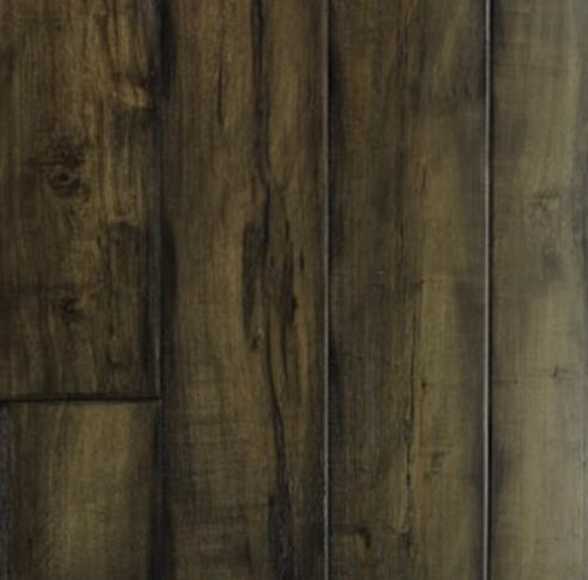
        
Alehouse

    

    

        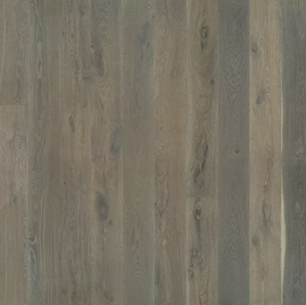
        
Alta Vista Hardwood

    

    

        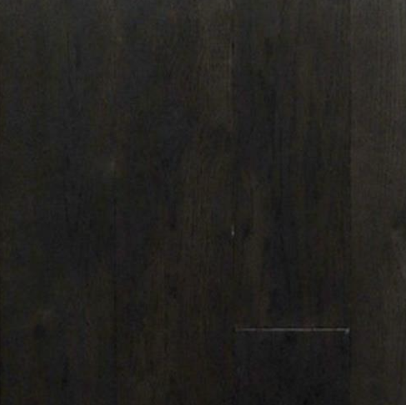
        
British Isles

    

    

        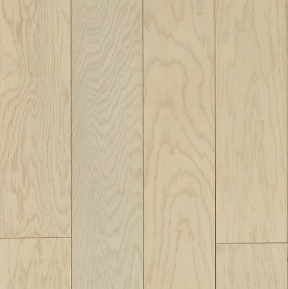
        
City Vouge

    

    

        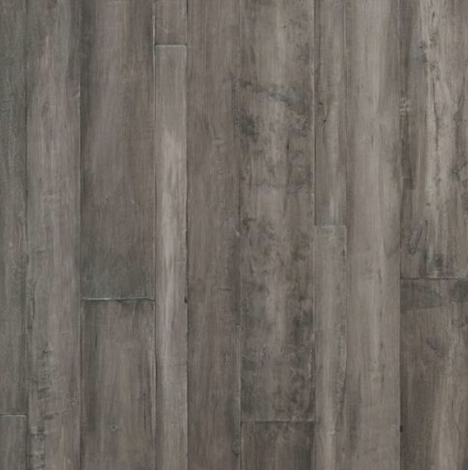
        
Designer Series

    

    

        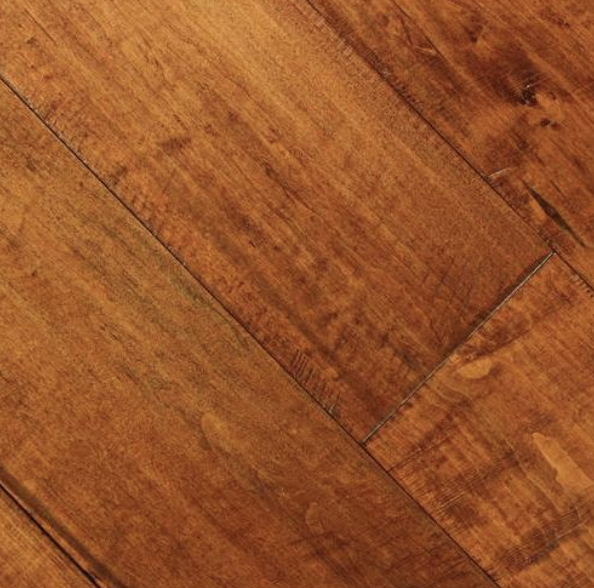
        
English Pub

    

    

        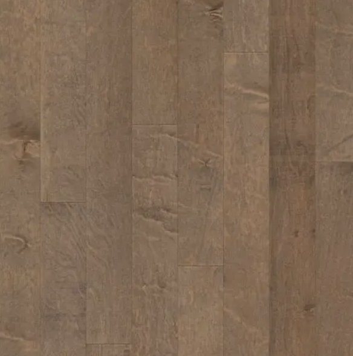
        
Essex Maple

    

    

        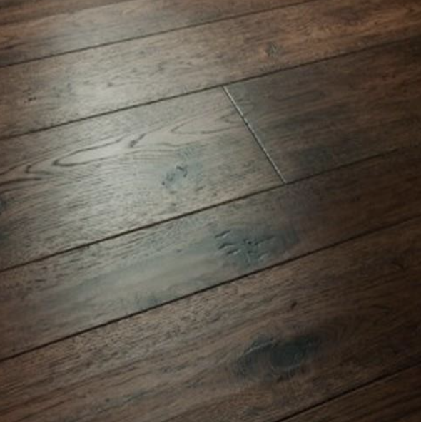
        
Monterey Hardwood

    

    

        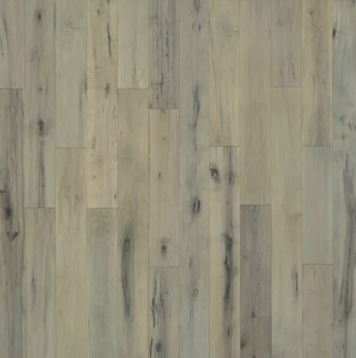
        
Novella

    

    

        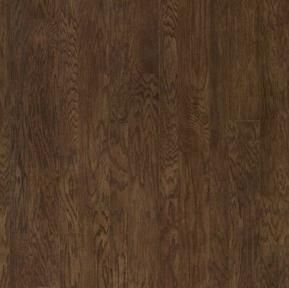
        
Oak Plank

    

    

        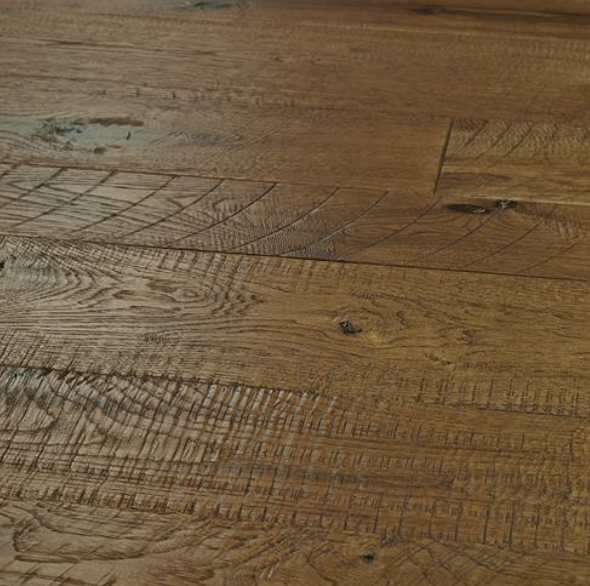
        
Organic 567 Engineered

    

    

        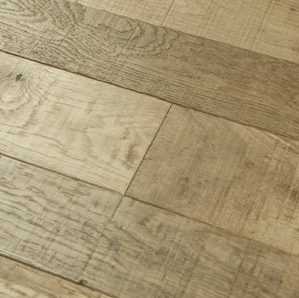
        
Organic Hardwood

    

